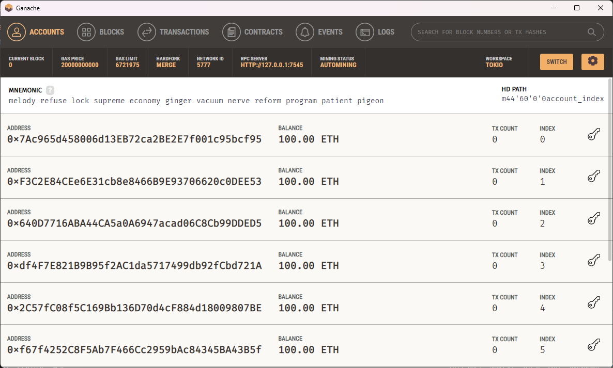
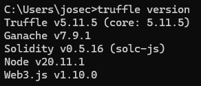

# Práctica M4_T4_P2
Para esta práctica entrarán en juego diferentes partes. La aplicación tendrás tecnologías como Ganache, Truffle, Node.js, Angular y se dividirá en tres elementos: 
<ul>
  <li>Una red blockchain en local</li>
  <li>Un backend que hará de servidor / API</li>
  <li>Un frontend desde el que lanzar las consultas</li>
</ul>  

### Índice
<ul>
  <li>
    <a href="#ganache">Ganache</a>
  </li>
  <li>
    <a href="#truffle">Truffle</a>
  </li>
  <li>
    <a href="#back-end">Back End</a>
  </li>
  <li>
    <a href="#front-end">Front End</a>
  </li>
</ul>

## Ganache
Lo primero que haremos será instalar [Ganache](https://archive.trufflesuite.com/ganache) en nuestro ordenador y crear un proyecto Ethereum que lo llamaremos Tokio.

## Truffle
Lo siguiente será instalar la suite de Truffle con `npm install -g truffle`. Para comprobar que se ha instalado correctamente ejecutaremos `truffle version`.

## Back End
## Front End