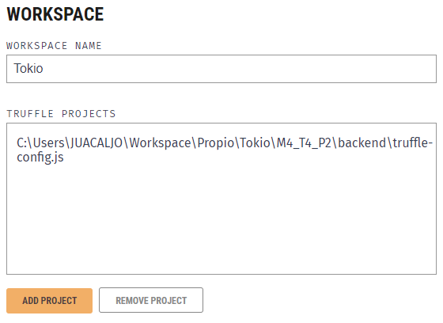
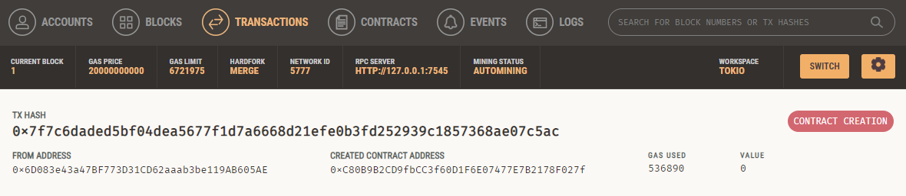
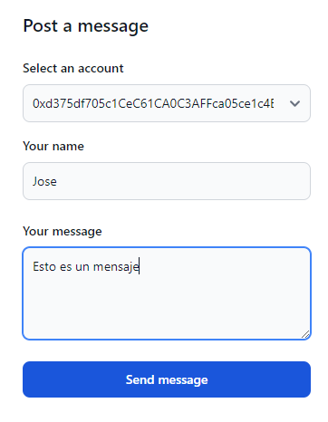
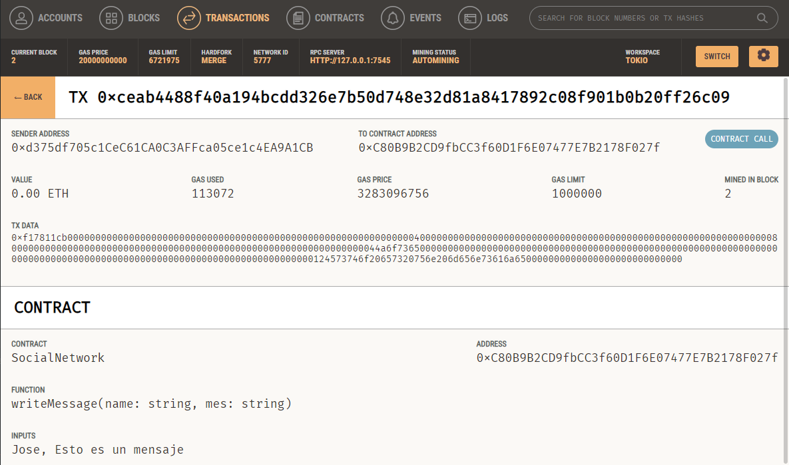
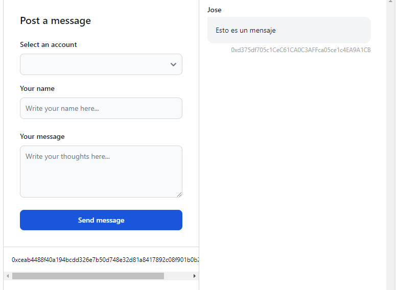

# Práctica M4_T4_P2
Para esta práctica entrarán en juego diferentes partes. La aplicación tendrá tecnologías como Ganache, Truffle, Node.js, Angular y se dividirá en tres elementos: 
<ul>
  <li>Una red blockchain en local</li>
  <li>Un backend que hará de servidor / API</li>
  <li>Un frontend desde el que lanzar las consultas</li>
</ul>  

## Índice
<ul>
  <li>
    <a href="#ganache">Ganache</a>
  </li>
  <li>
    <a href="#truffle">Truffle</a>
  </li>
  <li>
    <a href="#back-end">Back End</a>
    <ul>
      <li>
        <a href="#servidor-express">Servidor Express</a>
      </li>
      <li>
        <a href="#comandos-truffle">Comandos Truffle</a>
      </li>
      <li>
        <a href="#conexión-con-el-contrato">Conexión con el contrato</a>
      </li>
    </ul>
  </li>
  <li>
    <a href="#front-end">Front End</a>
  </li>
</ul>

## Ganache
Lo primero que haremos será instalar [Ganache](https://archive.trufflesuite.com/ganache) en nuestro ordenador y crear un proyecto Ethereum que lo llamaremos Tokio.

  

## Truffle
Lo siguiente será instalar la suite de Truffle con `npm install -g truffle`. Para comprobar que se ha instalado correctamente ejecutaremos `truffle version`.

  

## Back End
Creamos una carpeta **/backend** y dentro de la carpeta ejecutamos en la consola `npm init`, iremos aceptando todo hasta que se cree los archivos *package.json* y *package-lock.json*. Justamente después de esto ejecutaremos `truffle init` para iniciar un nuevo proyecto de Truffle. Además, también tendremos que instalar las librerías Express, CORS, Body-Parser y Web3.js con `npm install express cors body-parser web3`.  

Con lo anterior ya hecho, crearemos un fichero *index.js* donde pondremos nuestro servidor. Debería quedar una estructura así:
- /backend
  - /build
  - /contracts
  - /migrations
  - index.js
  - package-lock.json
  - package.json
  - truffle-config.json
  
### Servidor Express
Creamos nuestro servidor Express en *index.js*.

    const express = require('express');
    const cors = require('cors');
    const bodyParser = require('body-parser');

    const app = express();
    const port = 4000;
    app.use(cors());
    app.use(bodyParser.json());

Y lo iniciamos.

    app.listen(port, () => {
        console.log(`Server listening on port ${port}`)
    });

La API tendrá tres endpoints para interactuar con la blockchain de Ganache:
 - **GET /accounts** (Devuelve las direcciones de las billeteras existentes en la red de Ganache)
 - **GET /messages** (Devuelve todos los mensajes guardados en el Smart Contract, *getAllMessages*)
 - **POST /message** (Escribe un nuevo mensaje en el Smart Contract, *writeMessage*)

### Comandos Truffle
Para poder interactuar con el contrato que hicimos en la anterior práctica primero tendremos que compilarlo y después desplegarlo, pero primero necesitamos enlazar el proyecto de Truffle dentro de Ganache.  

  

Y después copiar el contrato en la carpeta */contracts* como **SocialNetwork.sol**.  
El contrato es exactamente el mismo que el de la práctica anterior. Una vez lo tengamos copiado en la carpeta pasaremos a **compilarlo**.

Compilar contrato (desde la carpeta raíz de backend):

    truffle compile

Con el comando **compile** se generará una nueva carpeta */build* con un archivo JSON que contendrá los datos del contrato (ABI y bytecode).  
Lo siguiente será desplegar el contrato pero para ello necesitamos generar un archivo de migración.

    // Comando
    truffle create migration deploy

    // Contenido del archivo generado
    var SocialNetwork = artifacts.require("SocialNetwork");

    module.exports = function(_deployer) {
      _deployer.deploy(SocialNetwork);
    };

En el archivo *truffle-config.js* tendremos que poner la URL del **RPC Server**.

    development: {
      host: "127.0.0.1",
      port: 7545,
      network_id: "*",
    }

Con todo configurado ya podremos hacer un despliegue del contracto.

    truffle migrate

  

### Conexión con el contrato
Con el contrato ya desplegado lo siguiente será conectarse a él para poder interactuar con sus funciones. Dentro de *index.js* añadimos el siguiente código:

    const { Web3 } = require("web3");
    const web3 = new Web3("http://127.0.0.1:7545"); // URL RPC Server

    const SocialNetwork = require("./build/contracts/SocialNetwork.json");
    const contractAddress = "0xC80B9B2CD9fbCC3f60D1F6E07477E7B2178F027f"; // Dirección contrato

    const instance = new web3.eth.Contract(
        SocialNetwork.abi,
        contractAddress
    );

Y arrancamos el backend: `npm start`.

## Front End
Para la parte del Front he realizado una pequeña aplicación en Angular que consiste en un formulario y un listado de los mensajes que vayamos generando. Rellenamos el formulario para crear un mensaje en el Smart Contract y lo enviamos. Este formulario envía una petición a la API (POST /message) y genera el mensaje.

  

Si volvemos a Ganache podremos fijarnos que se ha generado una nueva transacción con la dirección (billetera) que hemos seleccionado.

  

En el Front nos aparecerá el mensaje y el hash de la transacción.

  

