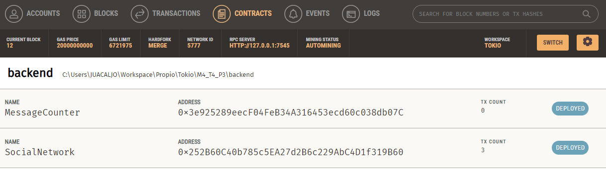
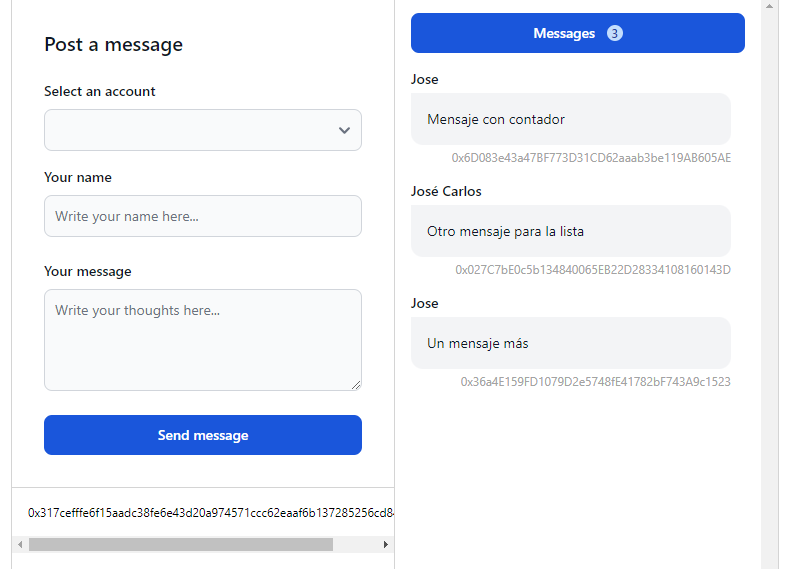
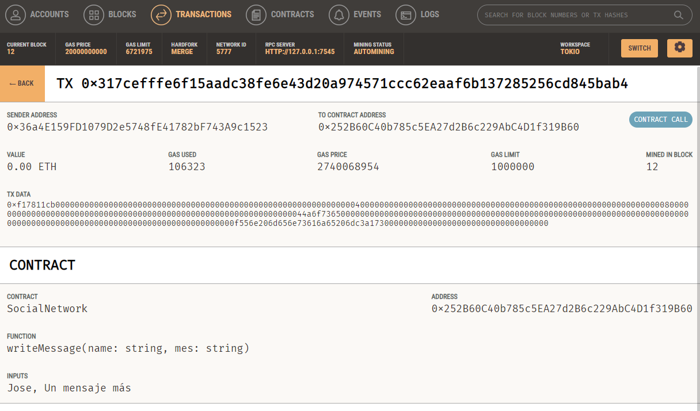
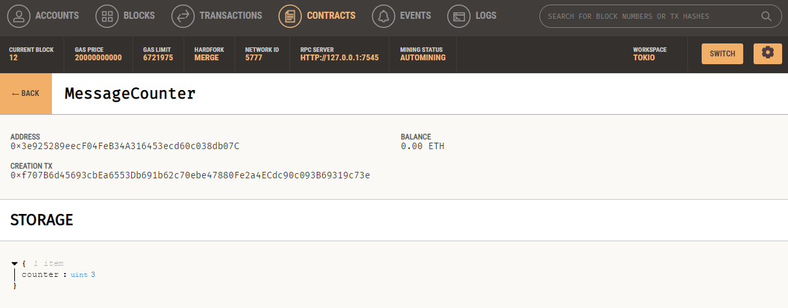

# Práctica M4_T4_P3
Para esta práctica reutilizaremos gran parte de la práctica anterior. Nuevamente la aplicación estará dividida en tres partes:
<ul>
  <li>Una red blockchain en local</li>
  <li>Un backend que hará de servidor / API</li>
  <li>Un frontend desde el que lanzar las consultas</li>
</ul>

## Índice
<ul>
  <li>
    <a href="#back-end">Back End</a>
    <ul>
      <li>
        <a href="#smart-contracts">Smart Contracts</a>
      </li>
      <li>
        <a href="#desplegar-contratos">Desplegar contratos</a>
      </li>
    </ul>
  </li>
  <li>
    <a href="#front-end">Front End</a>
  </li>
</ul>

## Back End
La parte del back será exactamente igual solo que ahora habrá un endpoint más (GET /counter) que llamará a la función *getCount()* del nuevo contrato **MessageCounter**. Este nos devolverá el número de mensajes hasta el momento.

    app.get('/counter', async (req, res) => {
        try {
            const count = await MessageCounterInstance.methods.getCount().call();
            res.status(200).json({ count: Number(count) });

        } catch (error) {
            console.error(error);
            res.status(500).send(error.message)
        }
    });

### Smart Contracts
En esta práctica tendremos dos contratos:

#### SocialNetwork
SocialNetwork es igual que el contrato de las anteriores prácticas sólo que ahora tendrá una función más que conectará con el contrato *MessageCounter* para llevar un recuento de los mensajes generados. La función nueva es *countMessage()*.

    function countMessage() public {
        counterContract.count();
    }

Además se ha añadido un constructor para crear una instancia del contrato MessageCounter pasandole la dirección del contrato desplegado y así poder utilizar sus funciones dentro de SocialNetwork.

    constructor(address _counterContractAddress) {
        counterContract = MessageCounter(_counterContractAddress);
    }

La manera de contabilizar los mensajes será utilizando la función *countMessage()* dentro de *writeMessage()*.

    function writeMessage(string memory name, string memory mes) public {
        require(
            bytes(mes).length <= 300,
            "Message exceeds maximum length"
        );
        messages.push(Message(msg.sender, name, mes));
        countMessage(); // Aquí se contabiliza el mensaje
    }

#### MessageCounter
El contrato MessageCounter cuenta con dos funciones, una para sumar 1 al contador y otra para devolver el contador.

    // SPDX-License-Identifier: MIT
    pragma solidity >=0.7.0 <0.9.0;

    contract MessageCounter {
        uint256 counter;

        function count() public {
            counter += 1;
        }

        function getCount() public view returns (uint256) {
            return counter;
        }
    }

### Desplegar contratos
La manera de desplegar los contratos también cambia ya que ahora para utilizar el contrato SocialNetwork necesitamos la dirección del contrato desplegado MessageCounter. Por eso se debe cambiar el fichero de la migración.

    var MessageCounter = artifacts.require("MessageCounter");
    var SocialNetwork = artifacts.require("SocialNetwork");

    module.exports = async function(_deployer) {
      await _deployer.deploy(MessageCounter); // Primero desplegamos MessageCounter
      const instance = await MessageCounter.deployed();
      await _deployer.deploy(SocialNetwork, instance.address); // Desplegamos SocialNetwork con la address de MessageCounter
    };

Con todo listo ya podremos desplegar nuestros contratos.

    truffle migrate

  

## Front End
Para la parte del Front he cambiado ligeramente la interfaz para que ahora se puedan ver el recuento de mensajes hasta el momento. El número de mensajes se obtiene llamando al endpoint que he mencionado antes **(GET /counter)**.

  

Si nos fijamos en Ganache se puede ver la transacción del último mensaje.

  

Y como el contador del contrato MessageCounter va subiendo.

  

