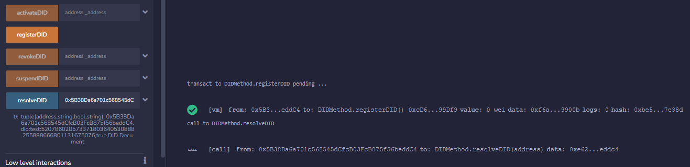

# Práctica M6_T2_P2
En esta práctica vamos a crear un aplicación descentralizada o Smart Contract que tendrá implementado un DID Method con sus correspondientes métodos y el cual generará un DID y con su DID Document. Para hacer este ejercicio me he basado en el Smart Contrat de [Gataca de DID Method](https://github.com/gataca-io/gataca-did-method/blob/master/gataca-did-contracts/GatacaID.sol).

## Índice
<ul>
  <li>
    <a href="#explicación-smart-contract">Explicación Smart Contract</a>
    <ul>
      <li>
        <a href="#struct-y-mapping">Struct y Mapping</a>
      </li>
      <li>
        <a href="#registerdid">RegisterDID</a>
      </li>
      <li>
        <a href="#resolvedid">ResolveDID</a>
      </li>
      <li>
        <a href="#activedid-y-suspenddid">ActiveDID y SuspendDID</a>
      </li>
      <li>
        <a href="#revokedid">RevokeDID</a>
      </li>
    </ul>
  </li>
  <li>
    <a href="#compilación-y-ejecución">Compilación y ejecución</a>
  </li>
</ul>

## Explicación Smart Contract
En este contrato hemos implementado un DID Method con sus correspondientes métodos (CRUD) para la creación de un DID: 
- Create (Register) 
- Read (Resolve) 
- Update (Activate y Suspend)
- Deactivate (Revoke)

### Struct y Mapping
Lo primero será declarar un Struct de un **DIDDocument**. El Struct tendrá las propiedades de **owner** que se será de tipo *address*, **DID** que será de tipo *string*, **status** que será de tipo *bool* y **data** que será de tipo *string*.
    
    struct DIDDocument {
        address owner;
        string DID;
        bool status;
        string data;
    }

Y un mapping para ir guardando los DIDDocument.

    mapping(address => DIDDocument) private registry;

### RegisterDID
Los objetos de DIDDocument los generaremos con el método *registerDID()*, que cogerá la dirección de la cartera que ejecuta el Smart Contract y la guardará en una posición del mapping *registry*. Para generar el DID, la address de la cartera se traduce a hexadecimal y se junta con el resto de la cadena "did:test:".

    function registerDID() public {
        DIDDocument memory doc = registry[msg.sender];
        require(bytes(doc.DID).length == 0, "did already in use");

        string memory hexAddress = Strings.toString(
            uint256(uint160(msg.sender))
        );

        registry[msg.sender] = DIDDocument({
            owner: msg.sender,
            DID: string.concat("did:test:", hexAddress),
            status: true,
            data: "DID Document"
        });
    }

### ResolveDID
Para traer de vuelta el DIDDocument que hemos generado previamente tendremos que ejecutar el método *resolveDID()*, al cual le pasaremos un *address* y nos devolverá un DIDDocument si existe un objeto con esa dirección asociada. Si no existe una dirección asociada saltará un error. 

    function resolveDID(address _address) public view returns (DIDDocument memory) {
        DIDDocument memory doc = registry[_address];
        require(bytes(doc.DID).length != 0, "invalid did");
        return doc;
    }

### ActiveDID y SuspendDID
Con los métodos *activeDID()* y *suspendDID()* podremos cambiar el estado el DID y activarlo o desactivarlo a nuestro antojo. Active pondrá **status** a *true* y Suspend pondrá **status** a *false*. Se le pasará la dirección de la cartera por parámetro, si no existe una dirección asociada saltará un error.

    function activateDID(address _address) public {
        DIDDocument memory doc = registry[_address];
        require(bytes(doc.DID).length != 0, "invalid did");
        registry[_address].status = true;
    }

    function suspendDID(address _address) public {
        DIDDocument memory doc = registry[_address];
        require(bytes(doc.DID).length != 0, "invalid did");
        registry[_address].status = false;
    }

### RevokeDID
El último método que nos encontraremos en el Smart Contract será revokeDID. Este nos servirá para borrar el DID del mapping registry. Si le pasamos una address que no existe nos dará un error. 

    function revokeDID(address _address) public {
        DIDDocument memory doc = registry[_address];
        require(bytes(doc.DID).length != 0, "invalid did");
        delete registry[_address];
    }

## Compilación y ejecución
Ahora pasaremos a la parte de donde compilaremos y ejecutaremos los métodos del contrato. 

Para ello abrimos el contrato en **Remix IDE** y nos vamos a la pestaña de *Compiler*. Nos aseguramos que la versión del compilador sea compatible con nuestro contrato. En mi caso elegiré la **0.8.22**.

  

Con el contrato compilado pasaremos a ejecutar los distintos métodos que trae. Para ello, nos vamos a pestaña de *Deploy & run transactions* y elegimos un entorno y una cartera. Después le damos a **Deploy**.

  

Con el contrato desplegado, primero generaremos el DID y luego lo traeremos de vuelta. Para ello ejecutamos *registerDID()* y *resolveDID()* con la dirección de la cartera. 

  

Vamos a ejecutar *suspendDID()* y después *resolveDID()*, veremos que status aparece a **false**. 

  

Vamos a ejecutar *activateDID()* y después *resolveDID()*, veremos que status aparece a **true**. 

  

Y por último ejecutaremos *revokeDID()* y traremos de vuelta el DID. Podremos ver como salta un error, ya que, el DID no existe en el registro. 

  

